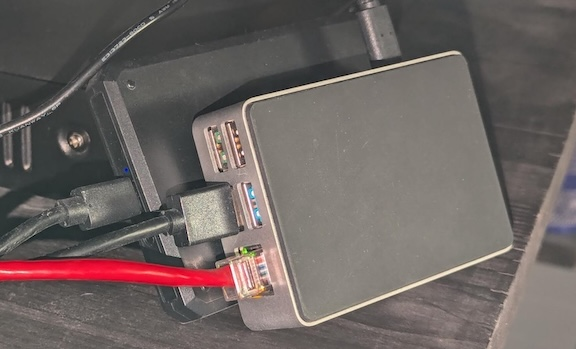
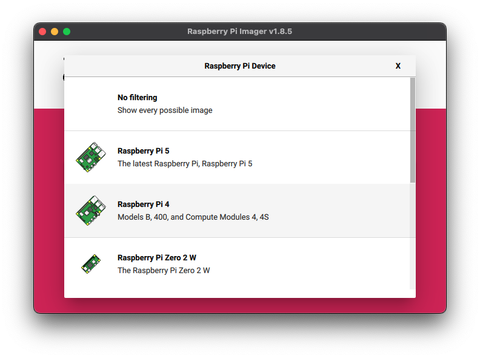
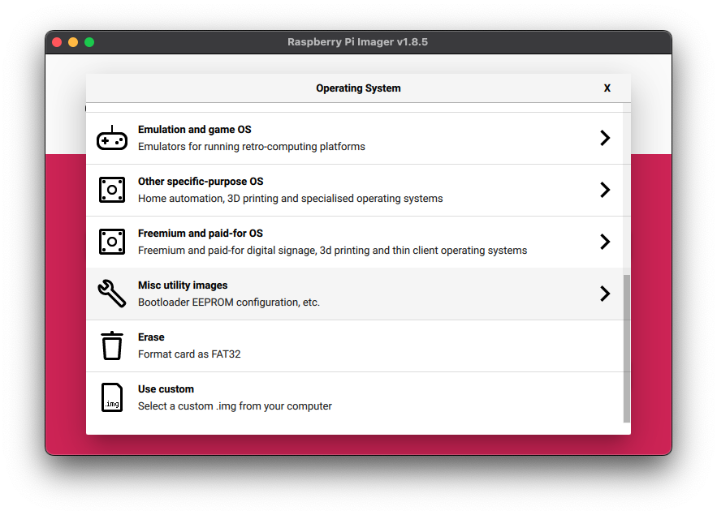
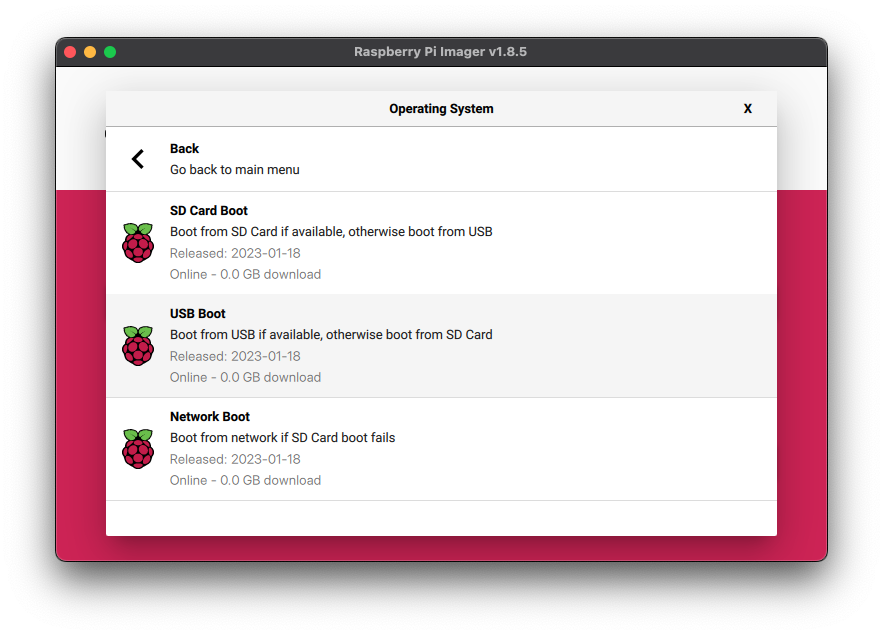
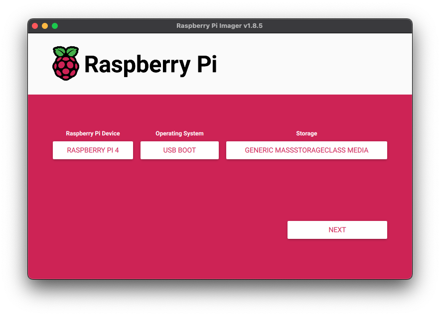
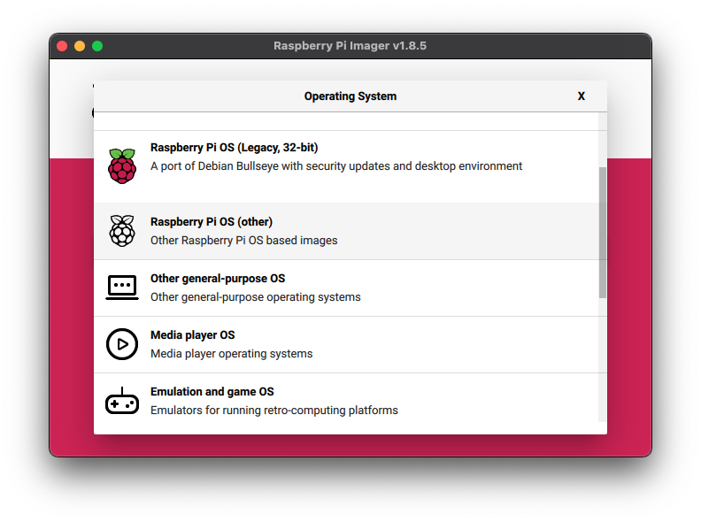
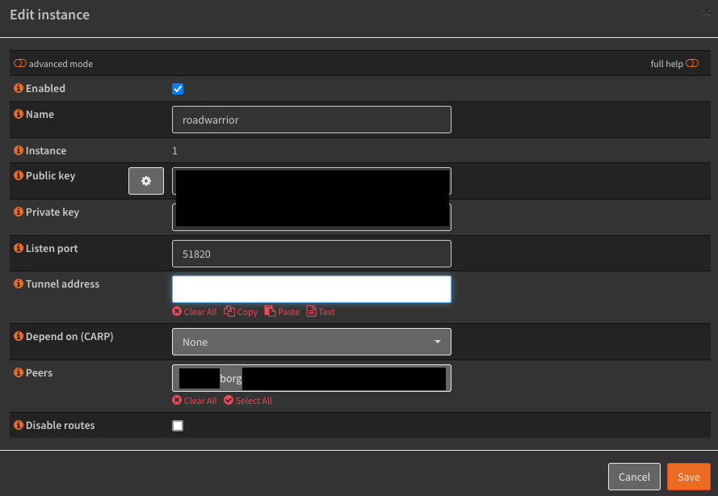
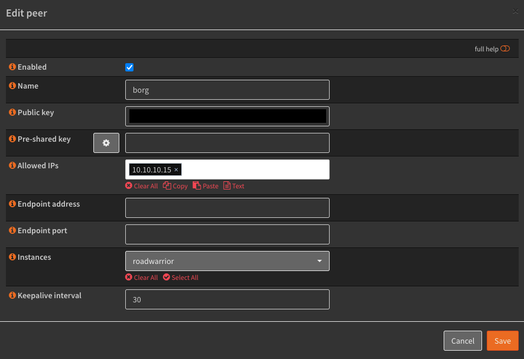
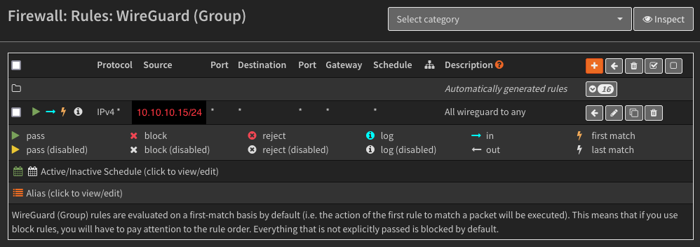

I set up a Raspberry Pi that boots from a 1T SSD. It is able to "phone home" to my home network via WireGuard allowing me to use it as a remote BorgBackup repository. Ask a friend or family member to plug this into their network and you have a large disk offsite backup location.

<!-- more -->



## Raspberry Pi setup
I'm my configuration I'm using a Raspberry Pi 4. I purchased a 1T Samsung SSD and a USB enclosure for it. 
You'll still need to configure the rPi to boot from USB by writing an image to an SD card first. The first time you boot the Pi using this image it will update to bootloader to look for a USB drive to boot from. 
Install the [Raspberry Pi Imager](https://www.raspberrypi.com/software/) and follow the directions to write that first image to the SD card.

Open up the Raspberry Pi Imager and select your rPi model.

Then under Operating System, instead of selecting Raspbian OS, scroll down to "Misc utility images".

Select USB Boot.

Pick your SD storage card and select next, going through the steps to write this image to the card.

Once you are through with these steps run the imager again, this time writing Raspbian OS to your SSD. I like to select "Raspberry Pi OS (other)" and install the version without the desktop. Follow the [rPi networking guide](https://www.raspberrypi.com/documentation/computers/getting-started.html#networking) to configure SSH, WiFi etc. You may want to configure the Pis WiFi to connect to your phone hotspot so you can test VPN connectivity to your network.

Plug the SD card and the USB drive into your rPi and boot. After your first boot, you can power off and remove the SD card, it isn't needed anymore!

## WireGuard setup
As of this writing the latest version of Raspbian OS (12, bookworm), you can install WireGuard from packages and don't need to do anything special. The way you will get a WireGuard network set up will vary greatly depending on what you are running for a router, or if you will be setting up another VM or rPi on your network to handle it. I'll leave some documentation below.

  * [OPNSense](https://docs.opnsense.org/manual/vpnet.html#wireguard)
  * [PfSense](https://docs.netgate.com/pfsense/en/latest/vpn/wireguard/index.html)
  * [RouterOS](https://help.mikrotik.com/docs/display/ROS/WireGuard)
  * [PiVPN](https://www.pivpn.io/) Set up another rPi on your home network to act as a VPN server.

I'll show you some screens for my own OPNSense setup here.
Configure a new instance. I called mine "roadwarrior". I also use this instance for my phone to have an always on fulltunnel VPN back to my home network.

Then make a new peer. You won't need to use the peer generator if you use the example config below.

Depending on how you have your router configured, you may need to manually add a firewall rule to allow traffic from your WireGuard VPN clients to the LAN network.



### rPi WireGuard config
Modify the below config and place into `/etc/wireguard/wg0.conf`. This allows for any device on my lan to reach my rPi. You will need to have `PersistentKeepalive` set because WireGuard will "down" the tunnel after inactivity. And you can't rely on the remote rPi to initiate a connection to bring the tunnel up. 

In this example:

  * WireGuard network = 10.10.10.0/24
  * Home LAN network = 192.168.1.0/24

```
[Interface]
PrivateKey = <redacted>
Address = 10.10.10.15
ListenPort = 51820

[Peer]
PublicKey = wD2eyYM/tNkSEzOU0wYStv74o4fQj1x8S6gej9Qr3x8=
PersistentKeepalive = 30
AllowedIPs = 10.10.10.0/24, 192.168.1.0/24
Endpoint = router.example.com:51820
```

### Test and start wireguard at boot
If you configured your rPi to connect to another WiFi network or your phonts hotspot, then you can test the WireGuard client by running:

    sudo wg-quick up wg0

To start during boot run:

    sudo systemctl enable wg-quick@wg0

## Borg backup setup
I use [Borg backup](https://www.borgbackup.org/) to back up my devices to a local server and to a remote Raspberry Pi. [restic](https://restic.net/) is another similar option that I haven't tried. The backups are encrypted and after the first backup, performed quickly. From my Macbook Air, I'm using [Vorta](https://vorta.borgbase.com/) to give me a GUI. From my FreeBSD and Debian servers, I'm using [borgmatic](https://torsion.org/borgmatic/). You can provide multiple repositories and it will back up to each one seperately.

