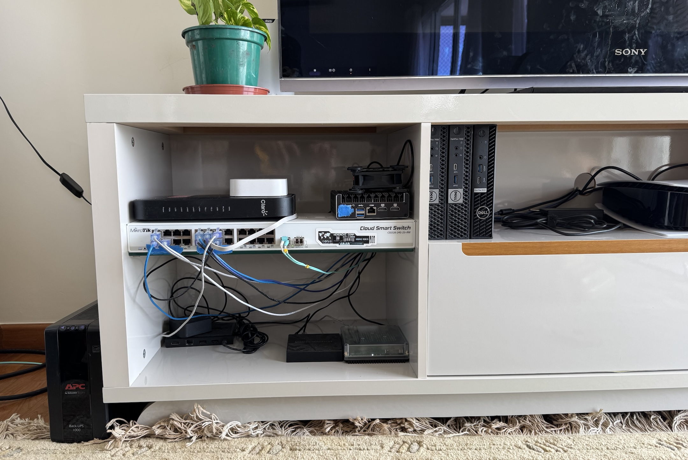

# My apartment home lab in Brazil

I've worked in datacenters for over 10 years. My dream was to live in a house with a basement where I could put a large rack full of eBay servers and replicate some of that experience. However I have grown to love living in tall buildings in big cities, and that means a smaller apartment where I have the challenges of heating, cooling, noise and large electric bills. Here is how I have a reasonable home lab configured now.

<!-- more -->

## Core network

The core of my network sits in my livingroom entertainment center. This ends up being a good place to put things because thats where the Claro GPON fiber goes into the modem, and the enterainment center works perfectly well as a place to store equipment. Plus the network gear is fanless and quiet. In the picture you'll see some tape covering some of the brightest lights. I have a pair of AC Infinity fans to help keep things cool. I like this better than taking apart hardware to replace moving parts.

## Mikrotik 24 port switch 
I love my Mikrotik 24 port [CSS326-24G-2S+RM](https://mikrotik.com/product/CSS326-24G-2SplusRM) switch. Yes it would be nice to have a CLI interface that could be managed with [Ansible](https://www.ansible.com/) or [Netmiko](https://github.com/ktbyers/netmiko) but the SwOS GUI in my home still allows me to have VLANS, SFP ports, forwarding and SNMP monitoring among other features. The price is right, the hardware is fanless and quiet, and receives regular updates (as opposed to old loud EOL hardware from eBay). Realistically, I don't need to manage a fleet of these things. It would be a different story in an enterprise environment with dozens to hundreds of switches.

## Protectli Vault FW4B running OPNsense for the firewall
I'm running [OPNsense](https://opnsense.org/) on a [Protectli](https://protectli.com/) FW4B. Another fanless and quiet device that has been reliable and powerful enough for my home needs. I have nice firewall and NAT rules, IPv6 support, UPnP restricted to a few devices like the PS5 and Nintendo Switch, and SNMP monitoring and more.

## Virtual Machine hosts
I have two Dell OptiPlex 7050 mini servers running proxmox. Not a big complicated cluster by any means, but they run a few VMs that get backed up to my FreeBSD server. A few services I'm running are:

  * VM running docker
    * [hashtopolis](https://github.com/hashtopolis/server)
    * [mealie](https://mealie.io/)
    * [immich](https://immich.app/)
    * [uptime-kuma](https://github.com/louislam/uptime-kuma)
    * [netboot.xyz](https://netboot.xyz/)
    * [Forgejo](https://forgejo.org/) action runner
    * Personal web apps I work on
  * A VM running [weechat](https://weechat.org/) and [Limnoria](https://github.com/ProgVal/Limnoria)
  * unifi controller

## Misc hardware
The entertainment center also seems to be an appropriate space to have some of my other miscellaneious hardware such as my [Home Assistant Green](https://www.home-assistant.io/green/) and Philips Hue hub. I don't have a lot of killer IoT home automation stuff going on anymore, but I like being able to control the lights from my phone and monitor temperature and humidity around the home.

## Office

In the office I have a Mikrotik 8 port [CSS610-8G-2S+IN](https://mikrotik.com/product/css610_8g_2s_in) switch. This is connected to the 24 port livingroom switch via multimode fiber. My wife and I work in this room and we each have a desk with a monitor, keyboard, and mouse connected to a dock that we can plug work and personal laptops into. We also each have desktop towers and I have my "pet" server running FreeBSD.

## FreeBSD server
To explain a little about why I love [FreeBSD](https://www.freebsd.org/), I've been running this thing without having to do a fresh install or relearn how to configure networking for years. This is my ZFS fileserver and runs a few other services. It has 8x 1T SSDs in a RAID 10 array and 8x 4T WD Reds in a RAIDz2 array. It contains backups from all my workstations and VMs, a MySQL database server, and hosts home directories for friends and family to back up their data.

Everything is installed in a [Fractal Design R5](https://www.fractal-design.com/products/cases/define/define-r5/blackout/) case. Its big and heavy, but has thick walls and quiet.

## rPi running at a friends hosue
The off site portion of my 321 backup solution consists of a rPi4 booting off a 1T SSD at a friends house. It is connected to my OPNsense firewall via wireguard and I have my workstations and servers backing up to it using [borg backup](https://www.borgbackup.org/).
